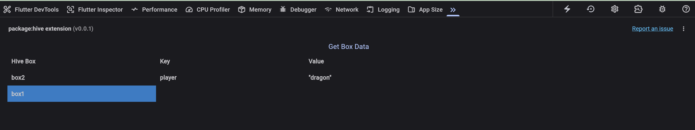

# 🐝 Hive DevTool for Dart DevTools
A Flutter package that integrates Hive with Dart DevTools, allowing developers to conveniently inspect and visualize Hive boxes and cached data directly within their development workflow.



## Features

- View all active Hive boxes in Dart DevTools
- Explore stored key-value pairs in real-time
- Improve debugging efficiency for apps using Hive for local storage

## Installation

```yaml
dev_dependencies:
  hive_dev_tools: 0.0.1
```

Create a file called `hive_service.dart`

Add the following code:

```dart
import 'dart:io';

import 'package:flutter/foundation.dart';
import 'package:hive_flutter/hive_flutter.dart';
import 'package:path_provider/path_provider.dart'
if (dart.library.html) 'src/stub/path_provider.dart';

class HiveService {
  const HiveService._();

  static var boxData = <String, Map<dynamic, dynamic>>{};

  static Future<Map<String, Map<dynamic, dynamic>>> getBoxData() async {
    final boxData = <String, Map<dynamic, dynamic>>{};
    if (!kDebugMode) {
      return boxData;
    }

    final boxNames = await _getBoxNames();

    for (final boxName in boxNames) {
      try {
        final box = await Hive.openBox(boxName);
        boxData[boxName] = box.toMap();
      } catch (e) {
        debugPrint('Error opening or reading box "$boxName": $e');
      }
    }
    HiveService.boxData = boxData;
    return boxData;
  }

  static Future<List<String>> _getBoxNames() async {
    final appDir = await getApplicationDocumentsDirectory();

    final directory = Directory(appDir.path);
    final List<FileSystemEntity> entities = await directory.list().toList();

    final List<String> boxNames =
    entities
        .where((file) => file.path.endsWith('.hive'))
        .map((file) => file.path.split('/').last.split('.hive').first)
        .toList();

    return boxNames;
  }
}


```

Then add the following command after Hive.initFlutter().
```dart
void main() async {
  await Hive.initFlutter();
  await HiveService.getBoxData();
  
  runApp(ExampleApp());
}
```

Please look at the example app as an example.

## 📢 Contributions
Contributions, issues, and feature requests are welcome!

## 📝 License

This project is licensed under the MIT License. 
